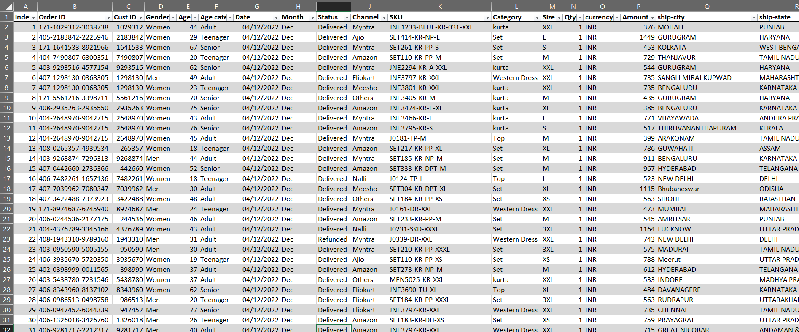
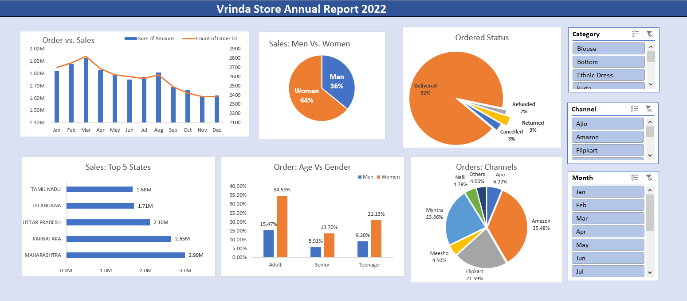

# Vrinda Store Sales report
Vrinda Store has been experiencing low sales growth over the past few years. To improve sales in 2023, the company needs to understand customer behavior, purchasing trends, and key sales drivers. By analyzing annual sales data for 2022, Vrinda Store aims to identify the areas that need improvement and develop targeted strategies to boost sales.

## Objective:
Vrinda Store wants to create a comprehensive Annual Sales Report for 2022 to gain insights into customer demographics, sales trends, and top-performing sales channels. The goal is to identify key growth opportunities and optimize marketing efforts for better sales performance in 2023.

## Dataset:

- `index` – A unique row identifier for the dataset.
- `Order ID` – A unique identifier assigned to each order.
- `Cust ID` – A unique identifier assigned to each customer.
- `Gender` – The gender of the customer (e.g., Male, Female, Other).
- `Age` – The age of the customer at the time of purchase.
- `Date` – The date on which the order was placed (YYYY-MM-DD format).
- `Status` – The current status of the order (e.g., Completed, Pending, Cancelled, Returned).
- `Channel` – The sales channel through which the order was placed (e.g., Amazon, Flipkart, Myntra).
- `SKU` – The Stock Keeping Unit, a unique identifier for each product.
- `Category` – The product category (e.g., Clothing, Electronics, Footwear).
- `Size` – The size of the purchased product (if applicable, e.g., S, M, L, XL for apparel).
- `Qty` – The quantity of items purchased in the order.
- `Currency` – The currency used for the transaction (e.g., INR, USD).
- `Amount` – The total amount paid for the order in the specified currency.
- `ship-city` – The destination city where the order was shipped.
- `ship-state` – The destination state where the order was shipped.
- `ship-postal`-code – The postal/ZIP code of the shipping address.
- `ship-country` – The destination country where the order was shipped.
- `B2B` – Indicates whether the order was a Business-to-Business (B2B) transaction (Yes/No).

## Data Cleaning:
1. In the `Gender` column, we apply find and replace for {'M':'Men', 'W': 'Women'}.
2. In the `Qty` column, we apply find and replace for {'One':1, 'Two':2}.
  Remmining all columns are in the right format.

## Data Processing
1. Make a modified column from `Age` column to the `Age Category` and divide in the 3 categories `Senior`, `Adult`, and `Teenager`. By using `IF` formula

   ```
   =IF(E2>=50,"Senior",IF(E2>=30,"Adult","Teenager"))
   ```
2. Make one more modified column from `Date` to `Month`. by using `Text()` formula.

    ```
    =TEXT(G2, "mmm')
    ```

## Data Analysis and Visualization
1. Make the pivot table by using **Month**,**sum of Amount** & **count of Order ID** . And inset the pivot chart (`Combo chart with Secondary Axis`: column chart for **sum of Amount** and line chart for **count of Order ID**).(explore the `Format axis Toolbar`)
2. Make pivot table by using **Gender** and **sum of Amount**. Make the `Pie chart`.
3. Make pivot table by using **status** and **count of Order ID**. Make the `Pie chart`. (explore the option `angle of first slice` to rotate the pie chart) 
4. Make pivot table by using **ship-state** and **Amount**. filter by `Top 10 Filter`. make the `Bar chart`.
5. Make the pivot table by using **Order ID**, **Gender** and **Age Group**.(`show values as` -->  `% of grand Total`). Make the `Clustered Column Chart`.
6. Make the pivot table by using **Channel**, **Count of Order Id** and make the `pie chart`.
7. Insert 3 slicers for **Month** , **Category** and **Channel**. (`Report connections` to all the pivot charts)

## Insights
1. Women contributed ~65% of total purchases.
2. Maharashtra, Karnataka, and Uttar Pradesh accounted for ~35% of total sales.
3. Adults (30-49 years) made up ~50% of the total orders.
4. Amazon, Flipkart, and Myntra collectively contributed ~80% of total sales.

## Conclusion & Strategy 
To maximize growth in 2023, Vrinda Store should focus on women aged 30-49 years in Maharashtra, Karnataka, and Uttar Pradesh by offering personalized promotions, targeted ads, and discount coupons on Amazon, Flipkart, and Myntra.
